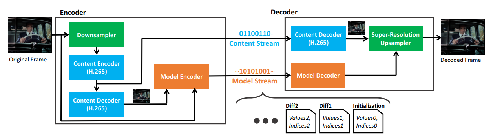

# SRVC - PyTorch Implementation
<p align='center'>

</p>

This repository holds my PyTorch implementation of the paper [**Efficient Video Compression via Content-Adaptive Super-Resolution**](https://arxiv.org/abs/2104.02322) (Khani et al., ICCV 2021). The original GitHub repository created by the authors of the paper, which is an implementation of the SRVC model in TensorFlow, can be found [**here**](https://github.com/AdaptiveVC/SRVC). 

Authors of the original paper: Mehrdad Khani, Vibhaalakshmi Sivaraman, Mohammad Alizadeh

## Introduction
In their paper, the authors provide a novel dual-stream approach to video streaming using deep learning. The Super-Resolution Video Compression model, or SRVC, combines a time-varying SR model that consists of a low-resolution video encoded using the H.265 codec as well as the fraction of parameters of a lightweight model with spatially-adaptive kernels. The above image shows the overall architecture as well as the training/inference process of SRVC.  

## Installation
Environment requirements are as follows. If your CUDA version is lower than the one mentioned here, please fully remove the CUDA package and install the required version. 
* Python 3.7 or higher
* PyTorch 1.12.0+cu116 or higher
* CUDA 11.7 or higher

1\) Create a [**Conda**](https://conda.io/projects/conda/en/latest/user-guide/install/index.html) virtual environment and activate it
```
conda create -n srvc python=3.7
conda activate srvc
```
2\) Clone repository
```
git clone https://github.com/james98kr/SRVC_PyTorch.git
cd SRVC_PyTorch
```
3\) Install dependencies
```
sudo apt-get install ffmpeg
pip3 install torch torchvision torchaudio --extra-index-url https://download.pytorch.org/whl/cu116
pip install -r requirements.txt
```
4\) Adjust configuration file

PLEASE CHANGE the file paths of line 1~5 of the file ``./configs/config.yaml`` according to your local environment. 

## Data Preparation
For data preparation, please refer to the [**data preparation guide**](./video_processing/README.md).

## Training
Once the data preparation is finished and the YUV-format high-resolution videos and the H.265-encoded low-resolution videos are ready, you can begin training the model with the following command:

```
python train.py ./configs/config.yaml
```

Make sure to check the ``./configs/config.yaml`` file before training. The ``crf`` value that you set in line 8 will indicate that you will train the model on all encoded videos with that specific CRF value. As for the hyperparameter values, the configuration file holds the default parameters that the author mentions in the original paper, but the ``epoch`` and ``batch_size`` are values that I picked from my own experiments, as the author does not mention specific values in the paper. 

For each video that you train, there will be one ``.pth`` file that will be saved in the ``./save`` directory as the model stream for that video. It will be saved as follows:
```
./save/{video_name}_crf{crf_value}_F{F_value}_seg{segment_length}.pth
```

## Inference
When finished with training, you can test the effectiveness of the compressed content/model stream by comparing the output of the model to the original video. The following metrics will be used.
* PSNR (peak signal-to-noise ratio)
* SSIM (structural similarity index measure)

You can change the ``crf``, ``F``, ``segment_length`` values in ``./configs/config.yaml`` in order to select which file you want to test. You can test the model with the following command:
```
python test.py ./configs/config.yaml
```
For every video the model tests, there will be one ``.txt`` file created in the ``./log`` directory. You can check out the results of the test in the file.
```
./log/log_{video_name}_crf{crf_value}_F{F_value}_seg{segment_length}.txt
```

## References
Code is built based on the SRVC model described in the original [**SRVC paper**](https://arxiv.org/abs/2104.02322), and some of the code is borrowed from the official [**GitHub repo**](https://github.com/AdaptiveVC/SRVC) of SRVC. 